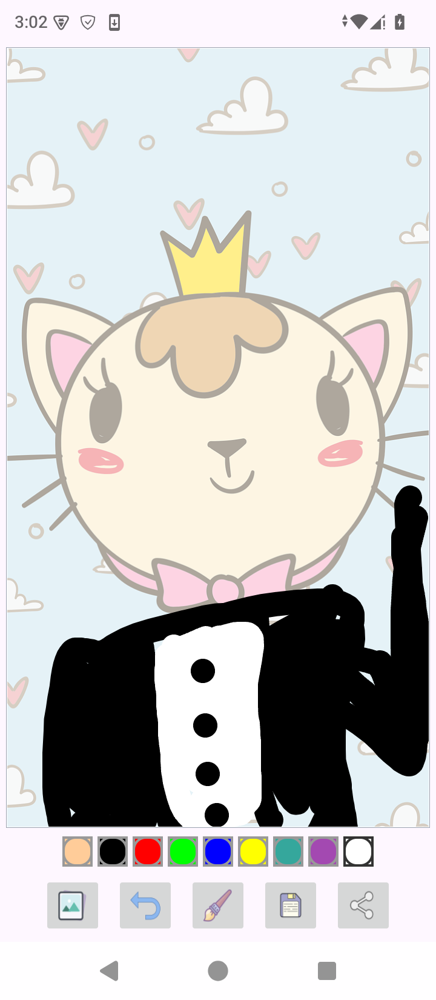

**Drawing Canvas App** is a powerful and intuitive Android drawing application built using **Kotlin** and **Jetpack Compose**.  
It offers a full-featured digital sketchpad with customizable tools, background selection, undo functionality, and the ability to save and share artwork — all within a smooth, modern UI.

The app is designed for creativity on the go, supporting artists, students, and casual doodlers with rich interaction and instant feedback.

**Features**

* **9 Vibrant Colors** — Choose from a curated palette of 9 colors for expressive drawing.

* **3 Brush Sizes** — Small, medium, and large stroke widths for fine details or bold lines.

* **Custom Background** — Set a solid color or image as the canvas background before drawing.

* **Undo Last Stroke** — Instantly revert the latest drawing action with a single tap.

* **Save to Gallery** — Export your artwork as a high-quality PNG image to the device.

* **Share Artwork** — Share your creation via WhatsApp, Instagram, email, or any app.

* **Smooth Touch Drawing** — Real-time rendering using `Canvas` and `Path` for fluid strokes.

* **Responsive Toolbar** — Clean bottom toolbar with color picker, brush size, background, undo, save, and share.

**App Flow**

1. **Main Canvas Screen**
    * Opens to a blank (or selected background) canvas ready for drawing.
    * Bottom toolbar displays all controls in a compact, accessible layout.

2. **Color Selection**
    * Tap the color palette icon → 9 circular color swatches appear.
    * Selected color is highlighted with a white border.

3. **Brush Size Picker**
    * Tap the brush icon → 3 size indicators (small circle, medium circle, large circle).
    * Preview stroke thickness in real time.

4. **Background Selector**
    * Tap the background icon → Choose from:
        * Solid colors (6 options)
        * Device gallery image
        * Default white

5. **Drawing Experience**
    * Touch and drag to draw smooth, pressure-sensitive-like lines.
    * Strokes are rendered instantly with anti-aliased paths.

6. **Undo Action**
    * Tap the undo arrow → Last path is removed from the drawing history.

7. **Save Drawing**
    * Tap the save icon → Artwork is saved to **Pictures/DrawingCanvas/** with timestamp.

8. **Share Drawing**
    * Tap the share icon → System share sheet opens with the current drawing as PNG.

**Tech Stack**

* **Language**: Kotlin
* **UI Framework**: Jetpack Compose
* **Architecture**: MVVM (ViewModel for state & drawing history)
* **Canvas API**: `Canvas`, `Path`, `PointerInput` for gesture detection
* **Image Handling**: Coil (optional) or Bitmap for save/share
* **Permissions**: `READ_EXTERNAL_STORAGE`, `WRITE_EXTERNAL_STORAGE` (or scoped storage)
* **Design System**: Material 3 (with custom themes and elevation)

## How to Get the APK

You can download and install the latest version of the app from the GitHub Releases page:

**[Download the latest APK here!](https://github.com/ahmedovich19/Drawing-app-in-android-kotlin/releases)**

*(This link will work after you follow the steps below and upload a release.)*

